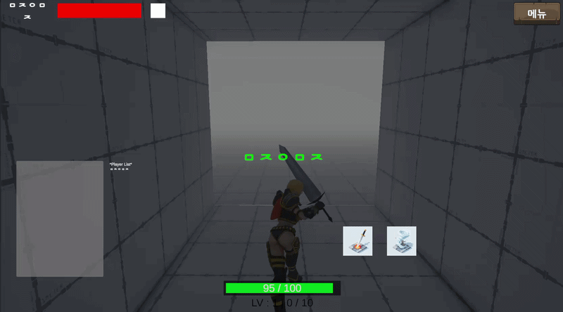

# 3D 액션 게임 — Photon 멀티플레이 RPG 시스템

판타지 세계관의 멀티플레이 3D 액션 게임. Photon PUN의 Master Client 권위 모델 위에 던전·파티·인벤토리·퀘스트·대화 시스템을 구현하고, MVP 패턴과 이벤트 버스로 시스템 간 결합도를 낮춘 2인 팀 프로젝트

> 🔄 **진행 중인 프로젝트의 포트폴리오 스냅샷입니다** (2026.06 기준 / 2026.01 집중 개발 1개월 후 간헐적 보완 중. 원본은 비공개 팀 레포)

📔 **[프로젝트 상세 문서 (Notion)](https://familiar-manx-10d.notion.site/3D-bce1a1efbfe383adadb78129ed48a45e)**

---

## 팀 구성 / 본인 담당

> 🙋 2인 팀 — **본인: 콘텐츠·데이터 시스템 및 네트워크 기능 담당**

| 구분 | 내용 |
|---|---|
| **본인** | GameEvents 정적 이벤트 버스 설계 — 시스템 간 직접 참조 제거 / 인벤토리·대화·퀘스트 MVP 패턴 적용 / NPC 대화(CSV 데이터 주도)·퀘스트(ScriptableObject)·세이브/로드(JSON) / 던전·파티의 Master Client 권위 RPC 로직 |
| 팀원 | 플레이어, 몬스터, 애니메이션, 사운드 |

> ⚠️ 코드 중심 포트폴리오 레포입니다. 에셋·씬은 제외되어 빌드는 불가하며, 플레이 영상은 노션에서 확인할 수 있습니다.

---

## 핵심 구현

- **이벤트 버스 (GameEvents)** — 인벤토리·스탯·퀘스트·대화가 서로를 직접 참조하지 않고 정적 `Action` 허브로만 통신. 장비 장착 → `OnItemEquipped` 발행 → PlayerStatus가 스탯 반영 → `OnStatusChanged` 발행 → UI 갱신. **발행자는 구독자를 모름** — 새 구독자를 추가해도 발행 측 코드 변경 0
- **Master Client 권위 모델** — 던전 입장·파티 생성/참가/위임 등 공유 상태 변경은 클라이언트가 직접 바꾸지 않고 마스터에 RPC 요청 → 마스터가 `IsMasterClient` 검증 후 처리 → 전체 브로드캐스트. 권위 주체를 한 곳에 고정해 동시 조작에도 정합성 유지. DungeonSystem·PartySystem을 **Client/Server partial class**로 나눠 요청과 권한 처리의 책임을 코드 수준에서 분리
- **데이터 주도 대화 시스템** — 대사를 외부 CSV로 분리하고 대사 한 줄마다 `eventType`(GiveItem·GiveQuest·CutScene·CreateMonster)을 부여 — **대사 데이터가 곧 연출 스크립트**. 기획자가 CSV만 고쳐도 연출 흐름이 바뀌고, 대사 추가 시 코드 변경 0
- **퀘스트 시스템** — 데이터(ScriptableObject)와 런타임 진행 상태 분리, `isSequential` 플래그로 순차/비순차 동시 지원, 진행도 JSON 저장·복구

## 대표 문제 해결 — 데이터 로딩과 UI 초기화 시점 불일치

- **현상**: JSON 데이터 로드·파싱보다 StatusView 초기화가 빨라, 스탯이 잠깐 기본값으로 표시됨
- **원인**: `Start`에서 동기적으로 처리하면 직렬화/역직렬화에 걸리는 시간 간극을 메울 수 없음
- **해결**: `IEnumerator` + `WaitUntil`로 데이터 로드 완료를 보장한 뒤 UI 갱신
- **기술 선택 근거**: async/await 대신 코루틴 — 이 문제의 본질은 "비동기 처리력"이 아니라 **"메인 스레드에서의 안전한 대기"**. Unity API·UI 갱신과 맞물리는 지점이라 스레드 안정성을 우선

📄 코드: [`PlayerStatusView.cs`](Assets/02.%20Script/Player/Status/PlayerStatusView.cs)

## 주요 코드 안내

| 파일 | 내용 |
|---|---|
| `GameEvents.cs` | 정적 이벤트 버스 — 결합도 제거의 중심 |
| `PartySystem.cs` / `DungeonSystem.cs` | Master Client 권위 RPC (Client/Server partial 분리) |
| `DialoguePresenter.cs` | CSV 데이터 주도 대화·연출 트리거 (MVP) |
| `QuestManager.cs` | 순차/비순차 퀘스트 진행 관리 |

---

📱 **Contact** — 000525jh@gmail.com · [전체 포트폴리오 (Notion)](https://familiar-manx-10d.notion.site/notion)
